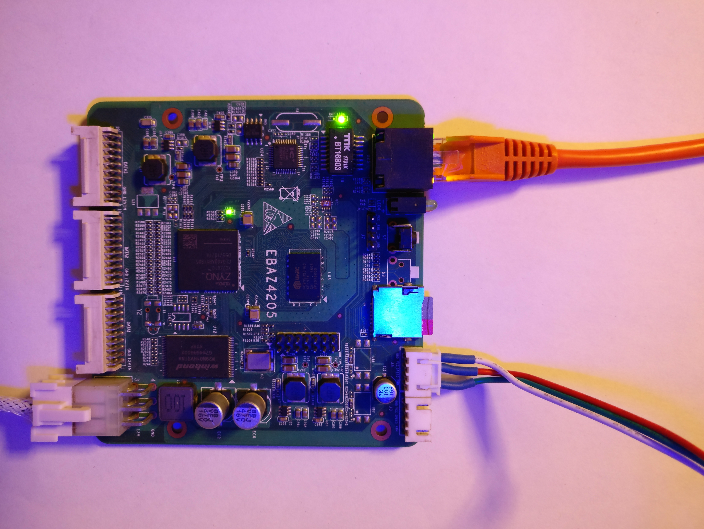

# ebaz4205-vivado
Vivado (2020.2) demo project for ebaz4205.

It is a demo project to drive addressable led strips.

The Vivado project adds minimal requirements for the ebaz4205 board:

- processing unit configuration to match attached components (DDR, NAND flash, ...)
- ethernet
- gpios (for the switch, and red and green leds)

And two blocks from a [addressable led controller IP](https://github.com/Halolo/Zynq_WS2812_AXILite) included here as submodule.

After running the synthesis, implementation and bitstream generation, the resulting file `addr-led.runs/impl_1/ebaz4205_wrapper.bit` can be used to generate the bootimage.
The bootimage packages the first stage bootloader, the FPGA bitstream and the second stage bootloader, i.e. u-boot (or a piece of code that can load it form the boot partition's file system).
The bootimage creation procedure will be added soon.

To test the led controllers from Linux via the AXI bus, you can use the [Yocto demo project](https://github.com/Halolo/ebaz4205-distro), just add the bootimage in the boot partition.

## The board
The ebaz4205 is based on a zynq 7Z010 from Xilinx (dual core Cortex A9 + Artix-7 FPGA).
It used to be the control card of a BTC miner. It is now massively decommissioned, and is (or was) available for sell for a very good price.

The hardware configuration of the board can vary from a seller to another and to be able to boot it from a SD card, you'll most likely need to do some hardware modifications.

### Resources
- [The first one to check](https://github.com/xjtuecho/EBAZ4205), at least for the README. Provides info about the board, schematics, conf files...
- [Tutorial](https://hhuysqt.github.io/zynq1/) explaining how to create a minimal Vivado project for the board (might not be your mother tongue but it is very well illustrated!)
- [A buildroot image](https://github.com/blkf2016/ebaz4205), very usefull to test your board

### Modifications
- Soldering D24 (I used a SK810L-TP) will allow you to power on the board via J4 (5-12V)
- To boot from SD card instead of NAND flash memory, move R2584 to R2577 (details and pictures [here](https://github.com/xjtuecho/EBAZ4205))
- Solder a sdcard socket on U7
- Solder a 1x4 pin header on J7 for access to the serial console UART
- Remove C304 and C333 close to J3 and J5 on the back of the board (details below)

## Led strip controllers
Exposed through J3 and J5 Connectors. These connectors were initially used for fan control.
It is convenient for LED strips because the connector exposes power pins + an I/O.
The capacitors C333 and C304 have to be removed as they filter "high frequency" (compared to the fan PWM) needed for the led strips.

Of course it is possible to route the data lines to a different IOs on DATA1-3 connectors but is is less convenient.

### Power
If D24 is present on the board, you can power the board via J4, and if you use a 5V power supply, you can get the power for the led strips directly from J3 and J5.

### WS2812B
One of the addressable led controller is setup to drive a 120 WS2812B leds strip and is exposed on J3 (pin marked 'PWM' on the board)

### APA106
The other one is setup to drive a 120 APA106 leds strip and is exposed on J5 (PWM pin)
